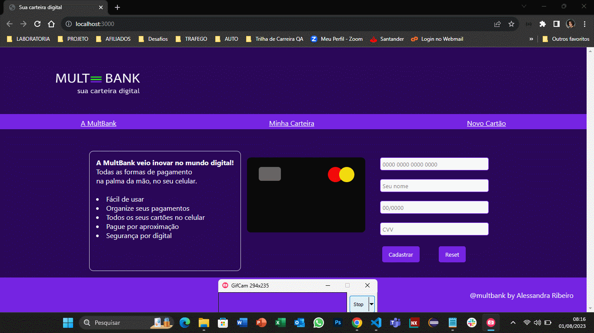

<h1> 

 

Projeto Card Validation: Mult Bank

</h1>

## 1. Introdução
Esse é o projeto nº 1 do Bootcamp Laboratório chamado Card Validation. Neste projeto, foi criado um aplicativo da Web que permite ao usuário validar o número de um cartão de crédito. Além disso, foi implementado a funcionalidade para ocultar todos os dígitos de um cartão, exceto os quatro últimos.

## 2. Resumo do projeto
O projeto é uma carteira digital da Multi Bank, onde o usuário poderá cadastrar todos os seus cartões de créditos e fazer seus pagamentos através de aproximação do celular e validar por meio da digital. Segue o layout inicial.

## 3. Considerações gerais
A MultBank veio inovar no mundo digital! Todas as formas de pagamento na palma da mão, no seu celular.

Fácil de usar
* Organize seus pagamentos
* Todos os seus cartões no celular
* Pague por aproximação
* Segurança por digital

## 4. Layout

## 5. Objetivos de Aprendizagem
   Para implementar esse projeto me desenvolvi em:
   * HTML semântico
   * CSS
   * Manipulação de DOM
   * JavaScript 
   * Test unitários Jest
   * Git e GitHub
   * GitPages

  Segue o resultado:

   
  
## 6. Implementação futuras

   Evoluir com o projeto até a conclusão: 
   * incluir mais páginas
   * mais funcionalidades
   * mudar as bandeiras daas operadoras

## 7. Contato
   
   Vamos nos conectar:

  <a href= "https://www.linkedin.com/in/alessandra-ribeiro-a99080a4/ " > Alessandra Ribeiro </a>